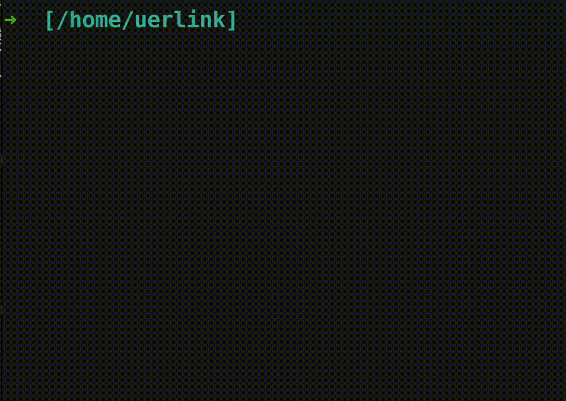

# 终端快捷小工具
一些终端可以快捷使用的小工具，但个人水平有限(初学者)

### 当前工具列表
- ##### [终端快捷翻译](./fy/README.md)
    
- ##### [终端快捷命令](./run/README.md)
    
### 安装
在项目根目录中运行 **install.sh** 文件
```bash
./install.sh
```
### 卸载
在项目根目录中运行 **uninstall.sh** 文件
```bash
./uninstall.sh
```

### 运行失败解决
1. 快捷翻译需要安装php环境
```bash
sudo apt-get install php
```
2. 快捷命令添加自定义命令后运行失败,请尝试添加 sudo 运行
```bash
sudo run 编号
```
